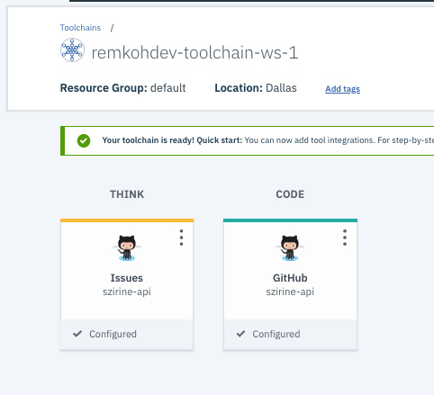
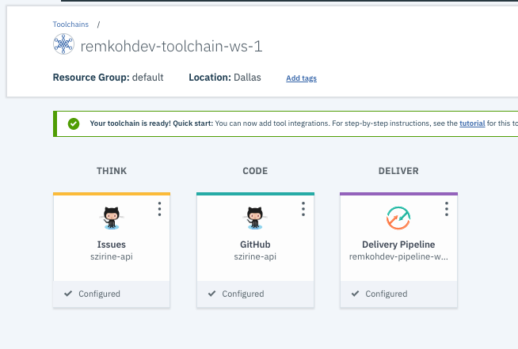
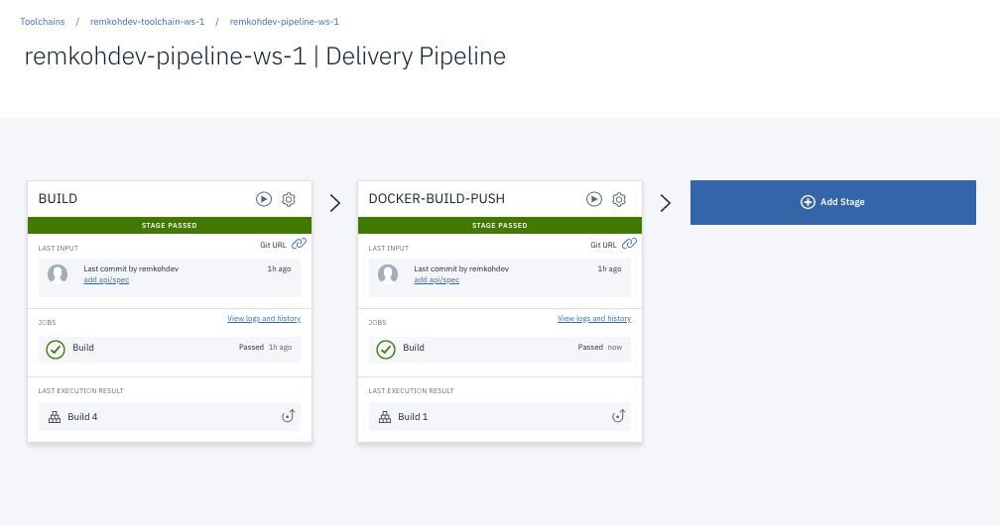

# Create a Continuous Delivery Pipeline

# Pre-requisite

* Fork https://github.com/szirine/szirine-api to your own repository, for example I forked mine to https://github.com/remkohdev/szirine-api. 

# Setup Continuous Delivery

1. Create a `Continuous Delivery` service
    * On IBM Cloud, click the `Create resource` button or go directly to the Catalog at https://cloud.ibm.com/catalog,
    * In the left menu of categories, select `Developer Tools`,
    * Click the `Continuous Delivery` panel, and click the `Create` button, 

2. Create a `Toolchain`
    * Go to https://cloud.ibm.com/devops/toolchains,
    * Select the Cloud Foundry Org and the Location, 
    * Click the `Create a Toolchain` button,
    * Select `Build your own toolchain`, rename the generated default Toolchain Name if you prefer, and click the `Create` button,

3. Add Github to the Toolchain,
    * Click the `Add a Tool` button,
    * Browse for your source code repository tool, in this case select the `Github` tool,
    * Click the `Authorize` button, select the appropriate authorizations, and click `Authorize IBM-Cloud` button,

    

    * Configure the Integration options,
        * Select the GitHub server,
        * Select the Repository Type, e.g. `Existing`,
        * Select the Reporitory URL, e.g. `https://github.com/szirine/szirine-api.git`,
        * Check the `Enable Github Issues` option,
        * Check the `Track deployment of code changes` option,
    * Click the `Create Integration` button,

    

4. Add a `Delivery Pipeline` to the Toolchain,
    * Click the `Add a Tool` button,
    * Browse for and select `Delivery Pipeline`,
    * Enter a `Pipeline name`, 
    * Click the `Add Integration` button,

    

5. Add a Build stage to the `Delivery Pipeline`,
    * Click the `Delivery Pipeline` in the toolchain under `DELIVER`,
    * Click `Add Stage`
    * Rename `MyStage` to `BUILD`,
    * Configure the `Input` tab,
        * For  `Input Type` select `Git repository`,
        * For `Git repository` select your repository, e.g. https://github.com/remkohdev/szirine-api.git
        * Verify the `Git URL`,
        * Select the correct `branch`,
        * Set the `Stage Trigger` options, 
            * Select `Run jobs automatically for Git events on the chosen branch`, and `When a commit is pushed`,
        * Check the option `Allow this stage to be run manually by all toolchain members`,
        * and click the `Save` button,
    * Add a job by configuring the `Jobs` tab,
        * Click the `ADD JOB` icon, and select the `Build` option,
        * Note that the forked application is a Node.js application with a package.json file, you can build the application with `npm install`, 
        * For `Builder type` select `npm`,
        * For `Pipeline image version` keep `Inherited from Configure Pipeline (1.0),
        * Under `Run conditions` check the `Stop running this stage if this job fails` option,
        * Click the `Save` button,
    * Click the `Run` button in the `BUILD` stage to test your build stage configuration,
    * After the `STAGE PASSED` and the status bar turns green, click the link to `View logs and history`,

6. Add a Docker Build and Push stage to the `Delivery Pipeline`,
    * Prepare:
        1. Find your cluster's zone,
            * Go to https://cloud.ibm.com/kubernetes/clusters,
            * Review the Location of your cluster,
        2. Create a namespace in your registry,
            * In the left menu, select `Registry`, select `Namespaces`,
            * Click the `Create namespace` button,
            * Enter a name under `Name` for your namespace, and click the `Create` button, e.g. `ws-1-ns`,
        3. Create an API Key
        https://cloud.ibm.com/docs/iam?topic=iam-userapikey#create_user_key
            * Go to Manage > Access (IAM) > IBM Cloud API keys.
            * Click Create an IBM Cloud API key.
            * Enter a name and description for your API key.
            * Click Create.
            * Copy the API Key and paste it into the `API Key` control, and click the `Authenticate` button,

    * Click the `Delivery Pipeline` in the toolchain under `DELIVER`,
    * Click `Add Stage`,
    * Rename `MyStage` to `DOCKER-BUILD-PUSH`,
    * Configure the `Input` tab,
        * For  `Input Type` select `Git repository`,
        * For `Git repository` select your repository, e.g. https://github.com/remkohdev/szirine-api.git
        * Verify the `Git URL`,
        * Select the correct `branch`,
        * Set the `Stage Trigger` options, 
            * Select `Run jobs automatically for Git events on the chosen branch`, and `When a commit is pushed`,
        * Check the option `Allow this stage to be run manually by all toolchain members`,
        * and click the `Save` button,
    * Add a job by configuring the `Jobs` tab,
        * Click the `ADD JOB` icon, and select the `Build` option,
        * For `Builder type` select `Container Registry`,
        * For `Pipeline image version` keep `Inherited from Configure Pipeline (1.0),
        * Paste the API key created in the Prepare step,
        * When authenticated, the controls for `IBM Cloud Region`, `Account Name`, and `Container Registry namespace` will populate,
        * For `IBM Cloud Region` select your region, e.g. for Dallas select `US South`,
        * For `Account Name` select your account,
        * For `Container Registry namespace` select the namesapce created in the Prepare step,
        * For ``Docker image name` enter a image name or tag, e.g. `szirine-api`,
        * Review the `Build script` control,
        * Under `Run conditions` check the option `Stop running this stage if this job fails`,
        * Click the `Save` button,
    * Click the `Run` button in the `DOCKER-BUILD-PUSH` stage to test your build stage configuration,
    * Go to https://cloud.ibm.com/kubernetes/registry/main/images and make sure the image was pushed into our registry,
    * After the `STAGE PASSED` and the status bar turns green, click the link to `View logs and history`,

    

    