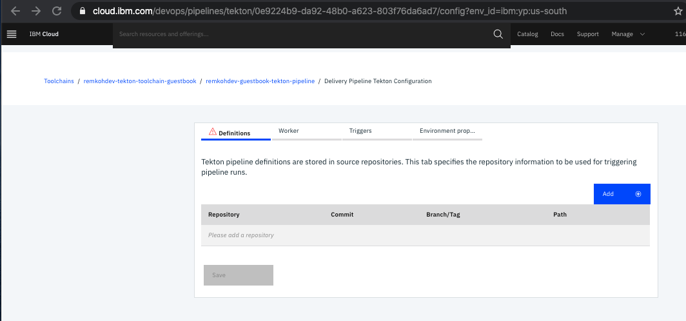

# Create a `Hello World` toolchain using a Tekton Pipeline

## Create a Toolchain

* Login to your IBM Cloud account,
* Go to the Catalog at https://cloud.ibm.com/catalog,
* Filter and search the catalog by `Toolchain`,

	

* In the `Create a Toolchain` page, filter and search by `own`,
* Click the `Build your own toolchain` window,

	

* In the `Build your own toolchain` page, edit the name to `username-tekton-toolchain-guestbook`,
* Select `Dallas` under `Region`,
* Select `default` under `resource group`,
* Click the blue `Create` button,

	

* Wait until the toolchain is created,

	

## Add a Source Provider

* In the `Overview` page of the toolchain, click the `Add a Tool` button,
* In the `Tool integration` page, filter and search by `git`,

	

* Click the `Github` tool,
* In the `Github` configuration window, select the `GitHub (https://github.com)` GitHub Server,
* For repository type select `Existing`,
* The first time, you will be asked to `Authorize`,
* For repository URL enter `https://github.com/remkohdev/guestbook` or your own fork,
* Unless you have Admin privileges on the repository, uncheck the checkboxes for `Enable GitHub Issues` and `Track deployment of code changes`, 

	

* Click `Create Integration`,

	

## Add 

* Create the `Add a Tool` button,
* Filter and search by `Delivery Pipeline`,

	

* In the `Configure the Integration` page for `Delivery Pipeline`, edit the `Pipeline name` and change it to `<username>-guestbook-tekton-pipeline`,
* Change the `Pipeline type` to `Tekton`,

	

* Click the `Create Integration` button,

	

* Click the `Delivery Pipeline` window to configure the Tekton pipeline,

	

* In the `Definitions` tab, click the `Add` button,
* Configure the `Definition Repository`,
* For `Repository` select the repository `guestbook (https://github.com/remkohdev/guestbook.git)`,
* Check the `Branch` option,
* Select the `master` branch,
* For `Path` enter the `./tekton/hello` folder,
* Click the `Add` button,

	

* This adds Tekton pipeline definitions to the Delivery Pipeline,

	

* Open the `Triggers` tab,

	

* Click the `Add trigger` button,

	

* Select the `Manual` option,
* There is only 1 EventListener defined in the guestbook Tekton pipeline,
* Under `EventListener` select the `hello-listener`,

	

* Click the `Save` button, 
* Click the `Close` button,
* The `Delivery Pipeline Tekton Dashboard` page loads,

	

* Click the `Run Pipeline` button,
* Select the `Manual Trigger - 0` option,

	

* The pipeline will run,

	

* When the pipeline successfully finished running, it will display a green checked icon,

	

* Click the linked pipeline name that finished running,
* The `Delivery Pipeline Tekton PipelineRun` page opens with PipelineRun details, among other the logs,

	


# Review the Tekton Definitions

* Go to the Guestbook repository and review the `.tekton/hello` folder at https://github.com/remkohdev/guestbook/tree/master/.tekton/hello,
* You will see 5 Tekton definition files,

	

* The `TriggerBinding` defines a Git Repository that runs when the Git event type occurs in the Git repo and branch. 

```
apiVersion: tekton.dev/v1alpha1
kind: TriggerBinding
metadata:
  name: hello-trigger-binding
spec:
  params:
    - name: repository
      value: "https://github.com/remkohdev/guestbook"
    - name: branch
      value: "master"
```  

* In our pipeline, we defined a manual trigger, but this `TriggerBinding` is used by Tekton to essentially create a web hook for the Github repository. See also https://github.com/tektoncd/triggers.
* The `EventListener` defines a mapping from the `TriggerBinding` to a `TriggerTemplate`. 

```
apiVersion: tekton.dev/v1alpha1
kind: EventListener
metadata:
  name: hello-listener
spec:
  triggers:
    - binding:
        name: hello-trigger-binding
      template:
        name: hello-trigger-template
``` 

* In our pipeline, the `TriggerTemplate` creates a resource for a `PipelineRun` that references a `Pipeline`,

```
apiVersion: tekton.dev/v1alpha1
kind: TriggerTemplate
metadata:
  name: hello-trigger-template
spec:
  resourcetemplates:
    - apiVersion: tekton.dev/v1alpha1
      kind: PipelineRun
      metadata:
        name: pipelinerun-$(uid)
      spec:
        pipelineRef:
          name: hello-pipeline
```

* The `Pipeline` is a sequence of `Tasks` similar to a Jenkins pipeline. In fact, [Jenkins X Pipelines](https://jenkins-x.io/docs/concepts/jenkins-x-pipelines/) are based on Tekton Pipelines,

```
apiVersion: tekton.dev/v1alpha1
kind: Pipeline
metadata:
  name: hello-pipeline
spec:
  tasks:
    - name: pipeline-hello-task
      taskRef:
        name: hello-task
```

* Our simple `Hello World` pipeline has only 1 `Task`, which creates an `Ubuntu` image and runs the `echo` command with `args` of value `hello world`. 

```
apiVersion: tekton.dev/v1alpha1
kind: Task
metadata:
  name: hello-task
spec:
  steps:
    - name: echo
      image: ubuntu
      command:
        - echo
      args:
        - "hello world"
```

* As you saw, the logs of the pipeline displays the output `hello world`.
