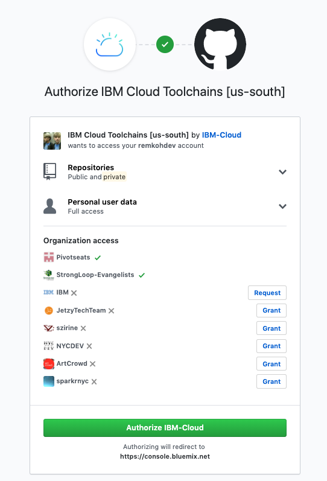

# Toolchain 3 - Build your own Toolchain

1. Create a Toolchain,
    * Go to https://cloud.ibm.com/devops/toolchains
    * Click the `Create a Toolchain`,
    * Select the `Build your own toolchain` template,

2. Configure the Toolchain, for:

    * Toolchain Name: `toolchain-custom-guestbook`,
    * Region: `Washington DC`
    * Resource Group: `default`
    * Select a source provider: `Github`,
    * Click the `Create` button, 

3. Add Github to the Toolchain,
    * Click the `Add a Tool` button,
    * Browse for your source code repository tool, in this case select the `Github` tool,
    * Click the `Authorize` button, select the appropriate authorizations, and click `Authorize IBM-Cloud` button,

    

    * Configure the Integration options,
        * Select the GitHub server,
        * Select the Repository Type, e.g. `Existing`,
        * Select the Reporitory URL, e.g. `https://github.com/<username>/guestbook.git`,
        * Check the `Enable Github Issues` option,
        * Check the `Track deployment of code changes` option,
    * Click the `Create Integration` button,


4. Add a `Delivery Pipeline` to the Toolchain,
    * Click the `Add a Tool` button,
    * Browse for and select `Delivery Pipeline`,
    * Enter a `Pipeline name`, e.g. `guestbook-custom-delivery-pipeline`,
    * Click the `Create Integration` button,


5. Add a Build stage to the `Delivery Pipeline`,
    * Click the `Delivery Pipeline` in the toolchain under `DELIVER`,
    * Click `Add Stage`
    * Rename `MyStage` to `CLONE`,
    * Configure the `Input` tab,
        * For  `Input Type` select `Git repository`,
        * For `Git repository` select your repository, https://github.com/<username>/guestbook.git
        * Verify the `Git URL`,
        * Select the correct `branch`, e.g. `master`,
        * Set the `Stage Trigger` options, 
            * Select `Run jobs automatically for Git events on the chosen branch`, and `When a commit is pushed`,
        * Check the option `Allow this stage to be run manually by all toolchain members`,
        * and click the `Save` button,
    * Add a job by configuring the `Jobs` tab,
        * Click the `ADD JOB` icon, and select the `Build` option,
        * The v2/guestbook is just a simple front-end application, consisting only of an HTML page with client-side Javascript code, so there is nothing to 'build' in this case yet,
        * For `Builder type` select `simple`,
        * For `Pipeline image version` keep `Inherited from Configure Pipeline (1.0),
        * Under `Run conditions` check the `Stop running this stage if this job fails` option,
        * Click the `Save` button,
    * Click the `Run` button in the `CLONE` stage to test your build stage configuration,
    * After the `STAGE PASSED` and the status bar turns green, click the link to `View logs and history`,


6. Add a Docker Build and Push stage to the `Delivery Pipeline`,
    * Prepare, using the [IBM Cloud Kubernetes Service plugin](https://cloud.ibm.com/docs/cli?topic=containers-cli-plugin-kubernetes-service-cli):

        1. Find your cluster's zone,

            * List all your clusters,
            
                ```console
                ibmcloud ks clusters
                OK
                Name                ID                     State    Created      Workers   Location   Version       Resource Group Name   
                my-cluster   abcdef1g2hijk3lmnopq   normal   4 days ago   1         Dallas     1.13.8_1529   default 
                ```
            
            * View the details of your cluster,

                ```console
                $ ibmcloud ks cluster-get --cluster my-cluster
                Retrieving cluster remkohdev-cluster...
                OK
                  
                Name:                           my-cluster   
                ID:                             abcdef1g2hijk3lmnopq   
                State:                          normal   
                Created:                        2019-07-18T18:13:33+0000   
                Location:                       hou02   
                Master URL:                     https://c5.dal12.containers.cloud.ibm.com:27008   
                Public Service Endpoint URL:    https://c5.dal12.containers.cloud.ibm.com:27008   
                Private Service Endpoint URL:   -   
                Master Location:                Dallas  
                ... and more
                ```

        2. Create a namespace in your registry,

            * Using the [ibmcloud cli with container-registry plugin](https://cloud.ibm.com/docs/cli?topic=container-registry-cli-plugin-containerregcli),
                * Login to the Container Registry,

                    ```console
                    $ ibmcloud cr login
                    ...
                    Logging in to 'us.icr.io'...
                    Logged in to 'us.icr.io'.

                    OK
                    ```
                
                * Create a namespace `guestbook-ns`,

                    ```console
                    $ ibmcloud cr namespace-add guestbook-ns
                    Adding namespace 'guestbook-ns'...

                    Successfully added namespace 'guestbook-ns'

                    OK
                    ```
                
                * Check that the namespace was created successfully,

                    ```console
                    $ ibmcloud cr namespace-list
                    Listing namespaces for account 'USER ONE's Account' in registry 'us.icr.io'...

                    Namespace    
                    guestbook-ns   

                    OK
                    ```

            * Or using the Web UI,
                * In the left menu, select `Registry`, select `Namespaces`,
                * Click the `Create namespace` button,
                * Enter a name under `Name` for your namespace: `guestbook-ns`, and click the `Create` button,

        3. Create an API Key,

            * The API Key is used to authenticate and authorize a push of the Docker image to the Container Registry. You can use the [IBM Cloud cli IAM feature](https://cloud.ibm.com/docs/cli/reference/ibmcloud?topic=cloud-cli-ibmcloud_commands_iam) to manage IAM access, API keys, service IDs and access groups,
            * Create an API Key,
            
                ```console
                $ ibmcloud iam api-key-create ibm-cloud-container-registry-apikey -d "API key to access IBM Cloud container registry" --file ibm-cloud-container-registry-apikey.json
                Creating API key ibm-cloud-container-registry-apikey as remkohdev@us.ibm.com...
                OK
                API key ibm-cloud-container-registry-apikey was created
                Successfully save API key information to ibm-cloud-container-registry-apikey.json
                ```

            * Open the downloaded file `ibm-cloud-container-registry-apikey.json`, 
            * Copy the API Key, you need to paste it into the `API Key` control in the next step,

    * Go to the `Delivery Pipeline` again, via the toolchain under `DELIVER`,
    * Click `Add Stage`,
    * Rename `MyStage` to `DOCKER-BUILD-PUSH`,

    * Configure the `Input` tab,
        * For  `Input Type` select `Git repository`,
        * For `Git repository` select your repository, e.g. `https://github.com/<username>/guestbook.git`,
        * Verify the `Git URL`,
        * Select the correct `branch`, e.g. `master`,
        * Set the `Stage Trigger` options, 
            * Select `Run jobs automatically for Git events on the chosen branch`, and `When a commit is pushed`,
        * Check the option `Allow this stage to be run manually by all toolchain members`,
        * and click the `Save` button,

    * Add a job by configuring the `Jobs` tab,
        * Click the `ADD JOB` icon, and select the `Build` option,
        * For `Builder type` select `Container Registry`,
        * For `Pipeline image version` keep `Inherited from Configure Pipeline (latest),
        * Paste the API key created in the Prepare step,
            * A popup window asks to input the API key,
            * Paste the API key,
            * Click the `Authenticate` button,
        * When authenticated, the controls for `IBM Cloud Region`, `Account Name`, and `Container Registry namespace` will populate,
        * For `IBM Cloud Region` select your region, 
            * e.g. for Dallas select `US South`, 
            * for Washington DC select `US East`,
        * For `Account Name` select your account,
        * For `Container Registry namespace` select the namesapce created in the Prepare step, `guestbook-ns`
        * For ``Docker image name` enter a image name or tag, e.g. `guestbook-v2`,
        * Review the script in the `Build script` control,
        * Under `Run conditions` check the option `Stop running this stage if this job fails`,

    * Configure the `Environment properties` in the `Environment properties` tab,

        * Add two new environment properties:
            * Click `Add property`, select `text property`,
            * For `Name` enter `DOCKER_ROOT`,
            * For `Value` enter `./v2/guestbook`,
            * Click `Add property`, select `text property`,
            * For `Name` enter `DOCKER_FILE`,
            * For `Value` enter `Dockerfile`,

    * Update the `Build script`,

        * The current build script expects a default Dockerfile in the root directory, but our Dockerfile is in the `v2/guestbook` directory. Replace the current build script by this build script:

            ```text
            #!/bin/bash
            echo -e "Build environment variables:"
            echo "REGISTRY_URL=${REGISTRY_URL}"
            echo "REGISTRY_NAMESPACE=${REGISTRY_NAMESPACE}"
            echo "IMAGE_NAME=${IMAGE_NAME}"
            echo "BUILD_NUMBER=${BUILD_NUMBER}"
            echo "DOCKER_ROOT=${DOCKER_ROOT}"
            echo "DOCKER_FILE=${DOCKER_FILE}"

            # Learn more about the available environment variables at:
            # https://cloud.ibm.com/docs/services/ContinuousDelivery?topic=ContinuousDelivery-deliverypipeline_environment#deliverypipeline_environment

            # To review or change build options use:
            # ibmcloud cr build --help

            echo "=========================================================="
            echo "Checking for Dockerfile at the repository root"
            if [ -z "${DOCKER_ROOT}" ]; then DOCKER_ROOT=. ; fi
            if [ -z "${DOCKER_FILE}" ]; then DOCKER_FILE=Dockerfile ; fi
            if [ -f ${DOCKER_ROOT}/${DOCKER_FILE} ]; then 
                echo -e "Dockerfile found at: ${DOCKER_FILE}"
            else
                echo "Dockerfile not found at: ${DOCKER_FILE}"
                exit 1
            fi
            echo "Linting Dockerfile"
            npm install -g dockerlint
            dockerlint -f ${DOCKER_ROOT}/${DOCKER_FILE}

            echo -e "Building container image"
            set -x
            ibmcloud cr build -t $REGISTRY_URL/$REGISTRY_NAMESPACE/$IMAGE_NAME:$BUILD_NUMBER -f $DOCKER_FILE $DOCKER_ROOT
            set +x
            ```

            * See I added environment variables for $DOCKER_ROOT and $DOCKER_FILE, added a more expansive check to ensure the Dockerfile is found, and added the `--file` flag and custom `DIRECTORY` to the `ibmcloud cr build` command,

    * Click the `Save` button,

    * Click the `Run` button in the `DOCKER-BUILD-PUSH` stage to test your build stage configuration,

    * Go to https://cloud.ibm.com/kubernetes/registry/main/images and make sure the image was pushed into our registry,

    * After the `STAGE PASSED` and the status bar turns green, click the link to `View logs and history`,

